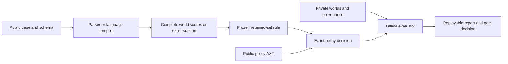

# Relational Belief Compilation: local research specification

Date: 28 September 2026. Status: specification for implementation; no experiments have been run. Audience: the agent implementing and evaluating the PoC on the user's Apple Silicon MacBook Pro with M3 Max.

This document translates the supplied research brief into executable contracts and decisions. The companion implementation plan defines ordered tasks and verification commands. Work stays on the current branch, `main`; use meaningful local commits. Planning does not install dependencies, download weights, train models, or establish a research result.

## 1. Intent, claims, and scope

Build the smallest reproducible experiment that can reject the proposed advantage early. RBC compiles a short English case and declared Boolean schema into a distribution over complete interpretations. Executable Boolean policies reuse that distribution. A retained-set decision accepts only when all retained interpretations agree. Recommendations exist only in a simulator.

Report these hypotheses separately:

| ID | Hypothesis | Evidence that can support it |
| --- | --- | --- |
| H1: representation | Dependencies improve accepted coverage over discarded dependencies at comparable error risk. | Joint versus marginal oracles; learned joint versus its own marginal product, with matched gates. |
| H2: learning | A small language-grounded model learns useful reusable joint beliefs competitively. | Text-only learned methods versus competent parser, pairwise, direct predictor, and available local LLM. |
| H3: training interaction | Policy-outcome supervision adds generalization beyond identical joint state-NLL training. | Paired architecture/initialization/data/updates, held-out policy truth tables, risk bounds, and seed sensitivity. |

A numeric oracle establishes no language-learning result. A useful joint-NLL model establishes no auxiliary-loss result. A negative or inconclusive result is successful completion when the next go/no-go decision is supported and artifacts verify.

The main learned universe is six Boolean slots: three known items, each with `damaged` and `unused`. These attributes can both be true. The logic kernel supports 1–12 variables; the learned head supports exactly six. Schema conditioning, alias changes, and fixed-ID reordering do not establish arbitrary runtime-schema generalization. Dates, arithmetic, permissions, and record matching are trusted code or supplied records.

Excluded: deployment, UI, services, agent framework, database, vector store, scheduler, distributed training, custom GPU kernels, probabilistic circuits, acquisition agents, continual learning, default 12-variable training, paid APIs, cloud machines, private datasets, gated-license acceptance, external messages/refunds/mutations, and execution of generated code.

### Chosen approach

| Approach | Trade-off | Decision |
| --- | --- | --- |
| Exact kernel and competent parser first; conditional learned stages | Produces an early falsifiable result and spends compute only on surviving claims. | Selected. |
| Implement every learned/LLM component before evaluating | Makes the full comparison available sooner in code, but spends effort before testing headroom. | Reject for this PoC. |
| Numeric oracle demonstration alone | Cheapest representation check; cannot answer language or training questions. | Valid stopping subset only when gates block further work. |

No gate may be relaxed after looking at its outcomes. A slice-specific continuation must name that slice and narrow the eventual claim.

## 2. Execution, resources, and dependencies

Use native arm64 Python 3.11 or 3.12 in `.venv`. Before installation, inspect Python/architecture, macOS, physical memory, free disk, and memory pressure. Do not change global Python. Physical memory and performance are measurements, not assumptions about M3 Max configurations.

| Resource | Ceiling or default |
| --- | --- |
| Total experiment compute after installation/downloads | 180 measured minutes |
| Local-LLM inference, within total | 60 measured minutes, including probes, selection, calibration, tests, and timing |
| Single optional encoder repair, within total | 30 measured minutes across all adapted variants |
| Nondependency core downloads | 500 MB, decimal bytes |
| Optional LLM model downloads | Additional 6 GB, decimal bytes |
| Encoder process route | At most 8 GiB, lowered to leave at least half physical memory for the OS/other apps |
| LLM process route | At most 12 GiB, similarly lowered |
| Encoding | Float32, batch 16 initially, `num_workers=0`, maximum 256 tokens including specials |
| Heads | Float32; CPU unless measured MPS speed and correctness justify otherwise |
| Reference/calibration/statistics | CPU NumPy/SciPy float64 |

Run heavyweight stages sequentially in separate processes. Do not retain the Torch encoder and MLX model concurrently. Record process RSS and accelerator counters separately; overlapping unified-memory counters are not additive. Do not disable allocator limits, modify system settings, or rely on sustained swapping. Reduce batches, use CPU, or report a limitation.

The budget ledger measures elapsed experiment work, including failed attempts, encoding, training, inference, calibration, evaluation, stress tests, and timing. Downloads/installations and human editing time are separate. Reserve a measured allowance for verification/reporting before scheduling more training. Forecast each job from a measured pilot; refuse jobs forecast to exceed the remaining total or category budget. Check deadlines at batch/token boundaries and checkpoint at configured intervals and graceful termination. A supervisor provides a hard stop for a nonresponsive worker; preserve the latest complete checkpoint and explicit unfinished-case statuses. Retries and resumed work never reset budget expenditure.

Core runtime dependencies: `numpy`, `scipy`, `PyYAML` (chosen to preserve `configs/poc.yaml`). Test extra: `pytest`. Learned extra: `torch`, `transformers`, `huggingface_hub`, `safetensors`. Optional local-LLM extra: `mlx-lm` and the Hub client if needed by that route. No convenience dependency for standard-library functions. Optional libraries import only inside their backend paths: importing the CLI, G0, verification, or reporting must not require them. Unavailable backend tests explicitly skip.

Resolve actual compatible package versions when implementation reaches setup; record a tested `requirements.lock.txt`, platform, Python version, and enabled extras. Do not put guessed version pins or fabricated snapshot hashes in this design. Reproduction installs the recorded environment and uses exact model/tokenizer commits and file hashes.

The encoder is `sentence-transformers/all-MiniLM-L6-v2`, loaded using `AutoTokenizer` and `AutoModel`, safetensors, and `trust_remote_code=False`. Its documented embedding dimension is 384 and default sentence-transformers truncation limit is 256 word pieces. Our contextual description-span pooling and explicit total-token rejection rule are project choices. [MiniLM card](https://huggingface.co/sentence-transformers/all-MiniLM-L6-v2)

The optional generator is `mlx-community/Qwen3-4B-4bit`, with upstream provenance `Qwen/Qwen3-4B`. It is a local comparator, with no claim to be the strongest available model. Use MLX-LM locally, without a server. [Conversion card](https://huggingface.co/mlx-community/Qwen3-4B-4bit), [MLX-LM](https://github.com/ml-explore/mlx-lm)

Resolve an exact public Hub commit, list the needed files and bytes, then download only tokenizer/config/safetensors files required by the route. Record model and tokenizer revisions separately even if identical. Never download all alternate weight formats. Disable supported telemetry and implicit credential use. All inference after provisioning uses local paths and must work offline; unrelated user credentials are never read. [Revision-pinned downloads](https://huggingface.co/docs/huggingface_hub/guides/download)

MPS selection requires `torch.backends.mps.is_available()`, a forward/backward smoke test, numerical comparison, and a speed measurement. Availability alone is insufficient. Use initial comparison tolerances `atol=1e-5`, `rtol=1e-4` and inspect discrete gate changes near thresholds independently. Record CPU fallback. [PyTorch MPS documentation](https://docs.pytorch.org/docs/stable/notes/mps.html)

## 3. Architecture and artifact boundaries

Use ordinary Python functions, dataclasses, argparse, JSON/JSONL, NPZ, and local files. No generic backend/plugin framework is needed.



| File | Responsibility |
| --- | --- |
| `src/rbc/types.py` | Public/private records, validated schemas, result and provenance types. |
| `src/rbc/logic.py` | AST validation, canonical worlds, scalar/vector execution, bundles, decisions. |
| `src/rbc/data.py` | Generator, renderers, splits, policy pools, manifests, leakage audits. |
| `src/rbc/model.py` | Lazy encoder, serialization/spans/cache, exact heads and losses. |
| `src/rbc/baselines.py` | Parser, trivial/oracle readouts, lazy local-LLM adapters. |
| `src/rbc/calibration.py` | Quantiles, development gates, risk intervals, power, paired bootstrap. |
| `src/rbc/experiment.py` | Doctor, downloads, budget, training, freeze/resume, stage gates, predictions, timing. |
| `src/rbc/report.py` | Artifact verification, metric replay, deterministic Markdown report and economics. |
| `src/rbc/__main__.py` | Thin argparse CLI. |

Keep the proposed module layout until a concrete implementation needs a small split. `tests/fixtures/` holds a tiny fixed dataset and predictions that need no downloads. Generated data lives under `data/`, large artifacts under ignored `runs/` paths, and downloaded weights outside Git. Keep runnable fixtures and docs tracked; distribute selected run artifacts explicitly instead of committing all caches.

### Public/private contract

`PublicCase` contains only `case_id`, `schema_id`, `schema`, `records`, and `text`. Each schema entry contains stable `id`, `entity`, and `meaning`. Public records are an allowlisted structured object; the initial clean workload uses `{}`. Future supported fields require explicit validation, with malformed or contradictory trusted values yielding `OutOfScope`. An undeclared entity in structured records is detectable scope failure; an undeclared entity only in prose is a grounding stress test.

`PrivateCase` contains `case_id`, `true_world`, observation program/results, oracle probabilities/support, group/split/renderer metadata, generation seed, and diagnostic relationship tags. Separate public/private JSONL readers and dataclasses are mandatory. `compile_case()` accepts only `PublicCase`. Model serialization excludes `case_id` and all evaluator metadata. IDs are opaque, answer-independent join keys.

Reject private keys nested in model-facing records. Prompts/cache input material must not contain an observation AST, latent world, posterior, split, label-derived tags, seed, or answer-bearing identifier. Evaluator joins happen after inference. A public-only compiler subprocess must succeed without access to private files.

### Artifact shapes

`run.json` stores format version, full effective config, source commit/dirty-state hash, environment and model versions, seeds, split/policy/input hashes, model/checkpoint hashes, gate decisions/reasons, budget ledger, planned panels and primary policies, selected operating points, and freeze/calibration provenance. Runtime-resolved fields are filled from observations; unresolved fields remain explicitly unexecuted and cannot masquerade as pinned assets.

`predictions.jsonl` stores one row per planned case/method/seed/policy with panel/group IDs, result status, action or witnesses, bundle/score reference, method-specific confidence, timing/failure/retry information, and primary-policy identity. State logits/probabilities/support for the complete universe live in compact NPZ alongside the rows. Arrays load with `allow_pickle=False`. Private truth is joined only in evaluation.

`metrics.json` and `REPORT.md` derive from saved predictions and private evaluator records. Small trained heads and optional adapted encoder blocks live in `checkpoints/`. Dataset files and split manifests remain addressable and hashed. Feature caches/model snapshots need not be distributed, but replay-required files must be.

## 4. Exact semantic contract

### Schema and worlds

Canonicalize nonempty unique string IDs by ascending lexical order. Save the ordered IDs and ID-to-bit mapping in every bundle. For `n` variables, enumerate every index `0 .. 2**n-1` with `world[j] = bool((index >> j) & 1)`. Reject `n=0`, `n>12`, duplicate IDs, unknown references, non-Boolean world values, and invalid dimensions. The learned route additionally checks the supported six-slot schema/version.

Reordering entries with unchanged IDs/meanings is exact canonicalization. Remapping IDs or meanings is a separately evaluated semantic change. Reordered world arrays must carry a validated bijection back to canonical indices. Never prune worlds, use a beam, or let a model choose the universe. Missing evidence leaves alternatives possible.

### Policy AST

JSON nodes use `op` and exactly the relevant fields:

| Node | Fields and validation |
| --- | --- |
| `var` | `id`: known string ID |
| `not` | `arg`: one AST |
| `and`, `or` | `args`: nonempty AST list |
| `xor` | `args`: exactly two ASTs |
| `count_eq`, `count_ge` | `ids`: nonempty distinct known IDs; `k`: integer in `[0, len(ids)]` |

Reject extra keys, booleans masquerading as integer thresholds, unknown operators, empty connectives/count lists, cyclic Python objects, excessive depth, and excessive size before evaluation. Root depth is one; maximum depth is six and maximum node count is 64. A count node counts as one node; referenced ID lists still validate and are bounded by the schema. Desugar implication/equivalence before validation and enforce limits on the expanded tree.

Every evaluation returns a Boolean. `evaluate_scalar` recursively interprets one world; `evaluate_worlds` independently vectorizes over all worlds. No `eval`, generated Python, callbacks, import instructions, filesystem/network capability, or arbitrary execution exists in the language. Trusted numerical operations precede AST creation.

### Beliefs and decisions

Configured compilers expose `compile_case(public_case) -> BeliefBundle | OutOfScope`. The explicit failure alternative makes input/backend rejection visible. A successful bundle holds canonical schema/world mapping, a tagged `DenseBelief` or `SupportBelief`, retained mask, format version, and hashes for evidence/records/schema/serialization/tokenizer/encoder/head/calibration.

`DenseBelief` has one finite logit per complete world; normalize with stable log-softmax. Any NaN or infinite logit is invalid. `SupportBelief` holds an exact Boolean support and, where known, full oracle probabilities. Structural zero probability in a support object is legitimate and is never treated as invalid dense logits. Empty support remains an explicit failure to accept.

`decide(bundle, policy_ast) -> Accept | Ambiguous | OutOfScope`:

1. Validate version, mapping, policy, belief, and retained mask.
2. An empty retained set returns `OutOfScope("empty_retained_set")`.
3. If every retained world gives the same result, return `Accept(action, certificate)`.
4. Otherwise return `Ambiguous(world_a, world_b)`, using the smallest canonical retained index of each action as deterministic witnesses.

The certificate identifies bundle/policy hashes, retained count, and the result common to all retained worlds. It asserts unanimity in that set, not truth of the text or retention of the actual world. Direct-probability/direct-predictor baselines use separately tagged decision evidence and must never receive a unanimity certificate they did not earn.

`load_bundle(path, expected_provenance)` verifies hashes before reuse. A caller changing evidence, records, schema meanings, model, or calibration must supply new expected provenance; the old bundle alone cannot discover external edits. Same-schema future policies reuse the bundle with zero encoder calls. New variables reject/recompile using a supported model; no untrained slot extension.

### Mandatory fixture

For IDs `[A_damaged, B_damaged]`, support is canonical indices `{1, 2}`, corresponding to `(True, False)` and `(False, True)`. `count_eq(...,1)` accepts true; conjunction accepts false; querying A is ambiguous with both witnesses. Marginals are `(0.5,0.5)`, whose product adds indices 0 and 3. Conventional XOR constraints and joint oracle give identical answers. The tie is a required test and report example.

## 5. Data, policies, and leakage prevention

### Clean generator

Use uniform six-bit latent states initially. Select workflow, queried item, observation plan, groups, and phrasing random streams independently of latent values. Probe results depend on the state; no other rendering choice may reveal it. The oracle evaluates the same deterministic observation process on all 64 worlds and normalizes the declared prior over consistent worlds. If later selection/noise depends on outcomes, implement its likelihood; compatibility alone does not justify a uniform posterior.

Freeze this workload before results:

| Component probability | Observation plan |
| --- | --- |
| 0.30 mostly explicit | Uniformly choose 4, 5, or 6 distinct variables to reveal. |
| 0.50 relational/count | Choose one or two probes: a count over two/three items for one attribute, or equality/difference between two attributes; optionally reveal zero or one individual variable. |
| 0.20 missing information | Reveal zero or one uniformly selected individual variable. |

These concrete probe-count choices resolve details left open in the brief; freeze them in config. Sample the component independently per source case; report realized frequencies, labels, and ambiguity without rebalancing. Avoid making every query repeat a stated relation.

Choose the public workflow uniformly from aggregate damage routing, item-specific triage, and a damage/unused combination; choose the item/group before seeing the world. Policy selection samples uniformly from eligible policies in the relevant pool/workflow. Freeze eligible lists and fallback-free selection rules before generation; fail setup if a workflow has no eligible policy. Ground truth never determines a policy.

Each renderer documents its observation-to-text mapping, including counts, negation, equality/difference, and no-information phrases. Names, clause order, alternate wording, and seed streams must not depend on unobserved values. Use explicit named references rather than ambiguous pronouns in the clean population. Hold contradictory prose and unknown entities for stress. Audit at least 20 G1 renderings, stratified across components and probe kinds, against private programs and save the review.

### Tracks and sizes

Keep numeric/kernel fixtures, controlled text, held-out wording/naming, stress/OOD, and any genuinely independently written cases distinct. Alternative renderers are authored before inspecting model failures and labeled **agent-authored generated text**. Optional local-LLM paraphrases need semantic verification and do not become human validation. No independent set is required; default status is `EXTERNAL_VALIDATION_NOT_PERFORMED`.

| Stage/split | Independent source groups |
| --- | --- |
| G1 development screen | 500 |
| G2 pilot train/development | 1,024 / 512 |
| Conditional main train/development | 6,000 / 1,000 |
| Conditional final calibration/test | 1,000 / 2,000 |
| Stress | 256 by default, within 200–400 |
| Optional LLM development/calibration/test | At most 256 / 256 / default 600 |

Use seed 17 for development training; reserve 29 and 43 for post-G2 sensitivity. Dataset/partition/bootstrap RNGs have separate fixed named seeds in config, not labels encoded into IDs. G1's 500 can be a declared subset of the 1,000 main development groups. Pilot train/development can be subsets of main train/development. Neither may migrate into calibration/test.

Assign independently generated source roots to splits before rendering or adding deliberate variants. An observation-family **instance** and its paraphrases/paired completions/counterfactual edits share a root group and split. Shared primitive relation types and naturally recurring observations are allowed across splits; do not group every recurrence of a Boolean vector or template together. Manifest rows identify parentage, renderer family, hashes, generation settings, and independently sampled recurrences.

Designate exactly one primary view per independent source group. Detect exact and normalized text duplication, distinguish copied derivatives from fresh recurrences using provenance, prohibit copied groups crossing splits, and report recurrence rates without rejection sampling away collisions. Calibration and test are a random partition of one reserved distribution, with the same held-out renderer-family mixture. Train and development may have distinct renderer families. Normalized duplicates are evidence to audit, not grounds for silently changing the primary population.

Final private calibration/test data are unavailable to training/prompt tuning. Calibration labels are used only for the prescribed state quantile. Reading test errors for debugging consumes that test; any corrected confirmatory rerun needs a newly frozen test set with the exploration disclosed.

### Policy composition holdout

Build gradient-training, development, and confirmation pools. Training uses simple formulas; development and confirmation add nested nontrivial compositions from supported operators. Canonical policy identity is the full 64-bit truth table in canonical world order, not AST text or a hash of syntax. Deduplicate equivalent formulas and make the three pool truth-table sets disjoint. Require nonconstant primary policies with 8–56 true worlds (each action at least 12.5%). Skewed policies/parity puzzles are separate slices.

A generated schema remapping must also remap truth tables before checking equivalence. Exclude confirmation truth tables from every gradient path, including the direct predictor. Development selection and shared primitives limit the claim to the specified withheld compositions. Freeze primary policy IDs per case; secondary 16-policy measurements never increase the independent sample size.

## 6. Models, features, objectives, and baselines

### Contextual features

Serialize canonical schema descriptions first, then evidence and relevant public records in a deterministic format. Save exact character spans for each variable description. A fast tokenizer supplies offsets; mean-pool final hidden tokens overlapping each description span, excluding special/padding tokens. Reject missing/empty spans or mismatched mappings. One full-context encoder pass produces `[6,384]`; target policy and case ID are absent.

Count tokens before inference with truncation disabled. The primary generator is designed and audited to fit the total 256-token limit before freezing. Unexpected overlength cases remain in the denominator as non-automated encoder outcomes. Parser/LLM receive their complete permitted input and their own capacity rules. Longer full-input cases are a separately labeled stress track.

Cache float32 features with input, canonicalization/serialization, tokenizer, and encoder content hashes. Adaptation invalidates all old features. Approximately 92 MB holds 10,000 six-slot examples; a memmap plus metadata is sufficient.

### Heads and losses

| Method | Head and learning rule |
| --- | --- |
| Independent | Flatten 2304 → Linear 128 → GELU → Linear 6; sigmoid bits; state likelihood is the sum of bit BCEs; form all 64 product probabilities. |
| Pairwise | Same feature/hidden path → 21 outputs: six unary plus 15 pair terms; energy `sum(a_i*y_i)+sum(b_ij*y_i*y_j)`; normalize over all 64; state NLL. |
| Joint-NLL | Flatten 2304 → Linear 128 → GELU → Linear 64; state NLL. |
| RBC | Identical joint head, plus the policy mass objective below. |
| Direct supervised | Concatenate flattened evidence and 64-bit public policy truth table → Linear 128 → GELU → Linear 1; Boolean BCE. Cache evidence and evaluate each policy separately. |

The joint head has 303,296 parameters; report actual parameter counts and compute for every head instead of implying all capacities match. All heads represent probabilities over the complete universe when applicable. State NLL uses the sampled true world; ambiguous repeated inputs with different legitimate worlds are expected.

For four training-pool policies sampled independently of the true answer per case/update:

```text
L_state = -log q(y* | public_case)
L_query = mean_pi[-logsumexp(log_q[y] where pi(y) == pi(y*))]
L_RBC   = L_state + lambda * L_query
```

Use trusted policy truth tables to compute targets and masks. Search only `lambda ∈ {0.2,1.0}`, with mandatory `lambda=0`. Labels derived from the true state add no independent information; the claim concerns finite-data optimization. Related semantic-loss work is precedent, not a novelty theorem. [Xu et al.](https://proceedings.mlr.press/v80/xu18h.html)

AdamW defaults: learning rate `3e-4`, batch 128 on cached features, maximum 20 epochs. Make otherwise implicit optimizer settings explicit in effective config (initial choice: betas 0.9/0.999, epsilon 1e-8, weight decay 0.01). Paired NLL/RBC runs share initial weights, example order, training cases, and optimizer update count; query sampling has a separate RNG. Train the full allowed update schedule and select checkpoints on development only. Log exposure and selected epoch. If paired checkpoint selection results in different exposure, disclose it and include the equal-update final checkpoints as an ablation. If RBC costs over 10% more, add one compute-matched joint-NLL continuation within the same remaining budget.

Before serious training, overfit 32 fully observed consistent cases to at least 98% exact state accuracy and finite gradients/loss. Separately test conflicting valid labels on identical ambiguous input without demanding zero NLL. Diagnose binding, negation, relation, missing-evidence, and fully-observed errors on development only.

One repair is permitted for a diagnosed frozen-feature failure: unfreeze the final two encoder blocks on the pilot, share the 30-minute total repair allowance fairly among the relevant heads, invalidate caches, and rerun G2. For a paired comparison, preserve identical starts and adaptation/update allowances; any unequal adapted encoders weaken the pure auxiliary-head interpretation and must be reported. No larger model or extra sweep. Failure ends the learned route.

### Baselines and readouts

Implement constant/majority (fit only train/dev), always-abstain, competent conventional parser, oracle exact posterior/support, and oracle marginal product before expensive backends. The parser handles all documented ordinary individual facts, negations, counts, equality/difference, and conjunctions; it receives schema semantics and train/dev error-analysis opportunity. Save implementation/tuning effort. It never reads private programs. Unsupported meaningful clauses produce a parse failure unless explicitly recognized as no information. Empty constraints from a valid no-information case retain all worlds; unsatisfiable constraints abstain.

Run independent, pairwise, joint-NLL, RBC, and direct supervised heads only after G1. From **each learned joint distribution**, also compute its own marginal product and a direct policy-mass probability. Each gets its prescribed development-selected gate; these cheap readouts can defeat the retained-set gate. Include accept-all curves for trivial and probabilistic methods, plus the oracle direct-policy probability curve.

Oracles are labeled nondeployable. The strongest deployable comparator is selected on development, among available substantive candidates, by eligible low-error coverage, then lower measured reuse time, then a stable method ID tie-break. Select independently for each named panel's permitted dev/calibration subset. Abstain-all is a reference, never a substitute for a tested substantive competitor.

### Optional local LLM

Run a 32-case development probe only when G1 still has a reason to investigate. Compare direct compound-policy decisions and one-call relational compilation without future policies. At most two prompt formulations per route; few-shots from train/dev only. Start non-thinking and compare one bounded thinking configuration on development. Pin prompts, template, tokenizer/model revisions, generation seeds, token/context limits, decoding settings, timeout, and repair policy. The upstream card documents the thinking switch. [Qwen3-4B](https://huggingface.co/Qwen/Qwen3-4B)

For direct decisions, prefer correct teacher-forced full-string likelihoods of the two Boolean answers if the resolved API supports them. Normalize as a ranking score, not a calibrated probability. Otherwise parse a strict true/false/abstain answer; record confidence limitations. No reasoning text is required for scoring.

The compiler emits only the bounded AST list. Empty list means all worlds; malformed or contradictory outputs are non-automated. Deduplicate constraints by truth table. Compare hard support and soft scores `-penalty * number_of_violations`, with development choice from `{2,5,10}`. The soft model is a ranking heuristic and may use state calibration. A declared deterministic repair may strip one enclosing Markdown code fence and surrounding whitespace; no semantic repair or model retry by default. Count repairs and their latency.

Before expensive calls, forecast **all** prompt/mode selection, gate-fit/check, 256 calibration cases when applicable, final panel, and timing calls. Bound total development to 256 fixed groups (including the 32 probe groups). Split gate-fit/check halves; cache reused responses. Freeze a random 600-group subset of final test before predictions, or a smaller panel before labels if throughput demands it. Refit cheap methods' operating gates using exactly the same LLM-panel development/calibration subsets, with unchanged weights. Report this common panel separately from the 1,000-calibration/2,000-test cheap-method panel.

Per-case timeout/invalid output counts as non-automated in the denominator. Global-stop unattempted cases make the planned panel incomplete; do not score a favorable prefix, convert unattempted cases into model errors, or support positive comparisons from it. An unavailable LLM permits no claim of beating local LLMs; this 4B result implies nothing about frontier models.

## 7. Calibration, inference risk, and statistical units

### State sets

For finite dense logits, `score(x,y)=max_z logits(x,z)-logits(x,y)`. On `m` independent calibration cases take rank `k=ceil((m+1)*(1-alpha))` with one-based indexing. If `k>m`, threshold is positive infinity and all finite-score worlds remain. Otherwise choose the kth smallest score. Retain scores `<= threshold`, including ties. Run calculations in CPU float64.

Reject nonfinite dense outputs before calibration. Do not silently remove failed calibration cases and change the population. If a method cannot produce valid scores for its planned calibration panel, mark that calibration infeasible and use a recorded abstain-all fallback for confirmatory set claims. Hard supports/oracles remain separately typed and do not need fabricated finite dense logits. A scalar positive-infinite threshold is valid; positive/negative-infinite dense logits are not.

Freeze model, serialization, and alpha before final calibration. Exchangeable calibration/test sampling is essential for the state-coverage statement. True-world retention makes any accepted same-schema policy correct, including later policies, but `P(accept and wrong)<=alpha` does not imply `P(wrong|accept)<=alpha`. [Conformal introduction](https://arxiv.org/abs/2107.07511)

### Development gates

Use alpha grid `{0.005,0.01,0.02,0.05}` and direct thresholds `{0.70,0.80,0.90,0.95,0.98,0.99,0.995,1.0}`. Divide development into fixed gate-fit/gate-check halves by source group. Fit provisional quantiles only on gate-fit. Choose the greatest gate-check coverage with empirical accepted error at most 1% and at least 50 accepted cases. Ties favor lower empirical error, then the more conservative threshold, then stable method ID. This is selection, not a risk guarantee.

If no point qualifies, record development-infeasible/abstain-all. After selection, refit only the specified set quantile on final calibration; keep direct thresholds fixed. Hard parsers have one fixed operating point subject to the same check. Save descriptive risk–coverage curves but never choose a confirmatory operating point on test. Threshold 1.0 must not round probabilities into certainty; record numeric precision and structural certainty separately.

### Primary statistics

One predeclared primary policy and one primary view per independent test source case. With `N` planned cases, `a` accepted cases, `e` accepted mistakes, report coverage `a/N`, risk `e/a`, and one-sided Clopper–Pearson upper bound:

```text
upper = beta.ppf(1-delta, e+1, a-e)   when 0 <= e < a
upper = 1                          when e == a or a == 0
risk  = undefined                  when a == 0
delta = 0.05 / M
```

Predeclare the distinct primary models for a named panel: RBC, joint-NLL, and the strongest development-selected deployable baseline, deduplicated if identities coincide. Usually `M=2` or `3`. Adjust across all bounds if claiming simultaneity across panels; otherwise label bounds panel-specific. Secondary seeds/readouts are descriptive unless their bounds are included in the declared family. Use SciPy's exact tooling as a cross-check. [SciPy binomial tests](https://docs.scipy.org/doc/scipy/reference/generated/scipy.stats.binomtest.html)

The main accepted-error target is 2%. Zero accepted errors with `M=3` needs at least 203 independent acceptances for this bound to be at most 2%, and 817 for 0.5%. The latter is an optional calculation. Before confirmation, estimate attainable acceptance from development coverage and calculate the maximal passing error count and binomial-CDF power at hypothetical true risks 0.5% and 1%. At 300 accepted cases at most one error passes; powers are approximately 56% and 20%. These are scenarios, not performance forecasts.

If zero-error feasibility fails, enlarge the panel only before test outcomes and within budget, or designate it inconclusive/exploratory. Do not loosen risk targets. Use 2,000 paired bootstrap resamples of source groups with seed 1729; report coverage-difference percentile 95% intervals on identical panels. Never pool three seeds or multiple policies into independent sample size. Seed 17 is primary; 29/43 are sensitivity. For 16-policy reuse, also report the fraction of cases with any wrong accepted action.

## 8. Gates, freezing, and resume behavior

CLI contract:

```bash
python -m rbc doctor
python -m rbc run --through g0 --config configs/poc.yaml
python -m rbc run --through g1 --config configs/poc.yaml
python -m rbc run --through g2 --config configs/poc.yaml
python -m rbc run --through g3 --config configs/poc.yaml
python -m rbc verify --run runs/<run_id>
python -m rbc report --run runs/<run_id>
```

The run ID is an explicit effective-config field; no silent selection of a latest directory. `--through` is an upper bound, not permission to cross a failed gate. Append G4 verification/report work relevant to completed stages after each requested run or scientific stop. A correctness failure produces its diagnostic report and a failed verification status, not a passing finalization. `verify` never launches training or downloads.

Persist stage states `not_attempted`, `running`, `passed`, `no_go`, `unavailable`, `budget_stopped`, and `failed_correctness`, with separate H1/H2/H3 status. A scientific no-go can have successful audit/exit; incorrect artifacts make verify exit nonzero. Atomically write artifacts and their hashes before marking a stage complete. Resume only compatible complete checkpoints/stages; reuse nothing with changed data, code, model, gate, or config dependencies. Detect simultaneous writers to one run directory. A changed frozen run requires a new ID and explicit lineage.

| Gate | Required evidence | Continuation or stop |
| --- | --- | --- |
| G0 correctness | Kernel, typed public/private data, oracle generator, statistical fixtures, offline replay skeleton. | All semantic/audit tests pass. Any mismatch, leakage, empty-set acceptance, or invalid risk bound blocks inference. |
| G1 headroom | 500 development cases, separate handwritten fixtures, parser/oracles, ≥20 rendering audits, optional LLM screen. | Joint-versus-marginal gap ≥10 percentage points on the mixture or a predeclared relevant slice, and a cheap relational baseline leaves ≥5 points credible headroom or a measured cost/reuse weakness. |
| G2 learnability | 1,024/512 features, overfit check, five heads, seed 17, readout controls, bounded repair only if justified. | Useful recovery of oracle headroom plus ≥5 points low-error coverage over strongest relevant inexpensive baseline, or coverage within 2 points and prospect of ≥3× faster quality-matched compile+16 future policies. |
| G3 confirmation | Main data, frozen checkpoints/gates/panels, calibration, paired predictions and intervals. | Apply quality/engineering criteria below; label low power or exhausted budget inconclusive. |
| G4 verification | Replay, stress, timing, artifact audit, final report for whatever ran. | Complete with supported, negative, or inconclusive conclusions. |

Resolve G1's “credible” operationally before the screen: the measured gap is at least five points and its paired development bootstrap lower bound is above zero. “Low error” uses the development rule (≤1%, ≥50 acceptances). If a fast competent parser is within five points of the relevant oracle at low error, stop learned work; the parser stop takes precedence over an equality at the five-point boundary. Do not worsen the grammar to restore headroom. LLM saturation can leave a predeclared efficiency-only route, with quality claims withdrawn.

For G2, explicitly report the fraction of the G1 oracle gap recovered by joint versus independent/own-marginal readouts and absolute coverages. “Meaningful” requires a positive measured recovery alongside one of the numeric quality/efficiency continuation rules; never use that adjective to bypass the thresholds. H3 proceeds only with RBC-minus-joint-NLL development advantage ≥2 points, or a positive separation at both fixed training sizes 512 and 1,024 on the same 512 development groups. Choose the two-size route in config before fitting, not after cherry-picking learning curves. Otherwise stop H3 spending and retain a joint route only on its own merits.

For live H3, run seeds 17/29/43 for both central variants after G2. If H3 stops, do not train extra RBC seeds solely to complete a table. Train only models relevant to surviving claims. Unfinished required sensitivity runs block a full positive H3 verdict.

Before **any final calibration fitting or final-test predictions**, save full effective config, checkpoint selection, primary seed, gate settings, selected comparator, hypothesis/claim scope, split hashes, primary policies, planned LLM panel IDs, risk family, and budget remaining in `run.json`. Then fit only prescribed quantiles and append values/provenance; hash and freeze the resulting bundle. This is an automatic record, not an approval ceremony.

### Confirmation decisions

A positive quality PoC requires all of:

1. RBC and each nonempty comparator used for a matched-risk claim meet the frozen 2% risk upper bound on the same panel.
2. RBC coverage advantage over the selected strongest deployable baseline is ≥10 percentage points and paired 95% lower bound is >5 points.
3. RBC advantage over identical joint-NLL is ≥3 points and paired lower bound is >0 to support H3.
4. Neither additional paired seed reverses the direction; show every seed.
5. No correctly evaluated stronger competitor eliminates the claimed advantage; disclose unexpected test winners.

Failure of (3) means `NO_AUXILIARY_TRAINING_GAIN`, even if H1/H2 have support. A bound failing because of limited acceptances is `INCONCLUSIVE_SAMPLE_SIZE`; empirical accepted risk above 2% is failure at that point. Abstain-all has zero automation and undefined conditional risk. An incomplete panel cannot support a positive comparison.

An engineering-only result requires a predeclared quality-matched comparison and ≥3× lower complete compile-plus-16-future-policy runtime, with ordinary caching/batching for all alternatives and training/amortization reported. It does not establish H3. Quality matching uses the same complete panel, frozen risk target, and coverage within two points, selected without test retuning.

## 9. Tests, stresses, timing, and economics

### Deterministic and statistical verification

Exhaustively test every nonempty retained subset up to three variables (including all 255 subsets for eight worlds), with every Boolean truth table over that small universe for unanimity/monotonicity. Separately exhaust small AST constructions and use fixed-seed randomized larger ASTs/schemas through 12 variables. Scalar/vector evaluators must agree; test complements, De Morgan, remapped world order, growing sets losing or preserving acceptance, and no acceptance from empty sets. Joint oracle and constraints must tie for identical information.

Test statistical ranks, ties, `k>m`, invalid logits, structural zeros, `a=0`, `e=a`, the 203/817 sample calculations, power, and group bootstrap. Public-only inference tests poison/remove private files and change private labels without changing features/prompts. Truth-table holdouts and copied-group detection must fail loudly on deliberate leakage.

### Stress obligations

| Stress | Required result or interpretation |
| --- | --- |
| Stable-ID schema reorder; remapped world/policy order | Same serialization/mapping/decision, up to declared floating tolerance where relevant. |
| Aliases and semantic-slot remaps | Measured language sensitivity, no assumed model invariance. |
| Negation edit; exactly-one → at-least-one | Oracle support changes correctly; report model tracking. |
| No evidence; full evidence | Broad uncertainty or a declared-prior decision; attainable singleton as learning diagnostic. |
| Invariant aggregate vs item-specific query | Accept unanimous action, abstain with witnesses when alternatives disagree. |
| Empty/contradictory support; malformed AST; duplicate/unknown IDs; n>12 | No acceptance; typed rejection. |
| NaN/infinite logits; ties; infinite threshold | Invalid logits fail closed; legitimate infinite threshold retains every finite-score world. |
| Artificial removal of the true candidate | Show failed coverage implication; production enumeration never prunes. |
| Undeclared structured/prose entity | Structured scope rejection; prose grounding failure measured separately. |
| Contradictory narrative and injection-like quoted instructions | Measure semantic failure/abstention; no tool/code side-effect path exists. |
| Evidence/record/model/calibration edit after compile | Expected-provenance check invalidates bundle. |
| Future policy; policy with new variable | Reuse with no encoder call; reject unsupported extension. |
| Longer input | Full-input stress per method; encoder explicitly rejects >256 and stays in denominator. |
| Pairwise versus higher-order parity | Separate demonstration, excluded from practical-workload headline. |
| Correlation shift | Frozen model/calibrator; measure harm without exchangeability claims. |
| Shifted recalibration | Separate shifted calibration/test; report coverage cost as well as risk recovery. |

For a concrete shift, keep public text/schema identical and other four variables independent uniform. Distribution A assigns equal probability to `(A_damaged,B_damaged)=(1,0),(0,1)`; B assigns equal probability to `(0,0),(1,1)`. Both have 0.5 marginals and the same public-input distribution. Use `count_eq([A_damaged,B_damaged],1)` as a diagnostic policy; its truth reverses. Only the evaluator receives the changed outcome law. This separate conditional-distribution fixture changes the declared prior for unobserved facts; it does not relabel a deterministic exactly-one sentence as false evidence. No input-only detector is guaranteed a signal. Recalibration uses fresh B calibration/test groups and old model weights.

Invalid-input/executor bugs block a positive implementation verdict until fixed. OOD semantic failures remain disclosed scope boundaries; fixing them after inspecting stress outcomes does not turn those examples into fresh confirmation data.

### Measurement

For every method/panel report planned, attempted, accepted, wrong accepted, coverage, risk/upper bound; state-set coverage and retained count mean/median; state NLL and posterior divergence where the generator provides truth; policy Brier score where a probability exists. Separate observations/action labels/relation order/ambiguity/wording/naming. Keep parse errors, OOS, timeout, retries, and globally unattempted counts visible. Direct-only methods use “not applicable” for state metrics. Irreducible latent ambiguity is not an annotation error.

Measure cold load separately, then warm full compilation (tokenize/encode/head/bundle), one-policy execution, and total 1/4/16 simultaneous and 1/4/16 future policies. Include process peak memory, artifact/cache size, training/encoding cost, failures, p50/p95, batch size, and throughput. At least ten warmups and 100 cheap-method cases; freeze and state a smaller LLM timing panel if budget requires. Synchronize MPS and materialize MLX results before stopping timers. Separate quality configuration from timing batch experiments.

Compilers run once per case; joint-NLL reuses exactly like RBC. Direct predictors cache evidence and LLM direct baselines may use batching/prefix reuse supported by their implementation. Do not repeatedly encode text to manufacture a speedup. Head-only microbenchmarks cannot be labeled full latency.

Economics is hypothetical sensitivity, with measured computation/amortization:

```text
cost_per_successful_case =
  (incremental_fixed_cost / volume + machine_cost_per_case
   + review_fraction * review_cost + audit_and_retry_cost_per_case)
  / end_to_end_success_rate
```

Show review costs $0.25/$1.50/$5.00, measured review-rate differences, zero review advantage, and a much cheaper LLM assumption. If review success is unknown, report cost per case and conditional break-even formulas instead. Include training/feature construction and future volume needed to amortize fixed computation. Do not invent labor cost, reviewer accuracy, business prevalence, or ROI.

## 10. Verification, reporting, and completion

`verify --run` is a local replay without model downloads or retraining. It must:

1. Check config/source/model/dataset/policy/split hashes and required replay files.
2. Audit model-facing public-only inputs and cache provenance.
3. Check source groups/copied derivatives and prohibited policy truth-table overlap.
4. Recompute metrics/intervals from per-case outputs and evaluator labels.
5. Reconcile every planned primary case/policy with result or execution status; flag incomplete panels.
6. Validate world/bundle mappings and replay accepted set decisions with the scalar executor; replay direct gates with their actual saved scores and compare actions to private truth.
7. Check threshold/checkpoint/prompt provenance, freeze ordering, and unchanged primary seed.
8. Run numerical/statistical edge fixtures and deterministic prediction replay.
9. Audit named runtime stages and measured versus hypothetical fields.
10. Exit nonzero for implementation/audit failures, while scientifically negative verified runs succeed.

Verification of external weight manifests is distinct from rehashing available bytes. If model files were intentionally omitted from a portable replay, report that byte-level weight verification is unavailable; prediction replay may still verify, but do not claim a full model-integrity audit. Tampering or a missing required prediction/data/bundle file is an audit failure. Source/checkpoint hashes and provenance records are always retained.

Every gate writes a report, including stops. `REPORT.md` begins with the outcome, then states what actually ran, H1/H2/H3 verdicts, strongest baseline, primary quality/risk table, auxiliary/readout ablations, Mac timings and budgets, stress failures, limitations, exact reproduction commands, and the smallest justified next step. Unsupported/unavailable/unattempted are distinct; missing results are never zero-valued measurements.

Supported statuses include `SUPPORTED_ON_GENERATED_WORKLOAD`, `ENGINEERING_ONLY_RESULT`, `NO_AUXILIARY_TRAINING_GAIN`, `NO_HEADROOM_OVER_SIMPLE_BASELINE`, `SMALL_MODEL_NOT_SUFFICIENT`, `INCONCLUSIVE_SAMPLE_SIZE`, `BASELINE_UNAVAILABLE`, `STOPPED_CORRECTNESS_BUG`, and `EXTERNAL_VALIDATION_NOT_PERFORMED`. Several may apply. Ordinary-parser ties, pairwise wins, and no auxiliary gain belong near the top.

The implemented README must document actual installation/lock commands, pinned snapshot fetching, each gate, and replay. Its effective config must identify enabled/unexecuted stages. Minimum reproduction after implementation:

```bash
python -m pytest -q
python -m rbc run --through g0 --config configs/poc.yaml
python -m rbc verify --run runs/<run_id>
python -m rbc report --run runs/<run_id>
```

If learning ran, also execute a tiny offline training smoke test with the installed backend. A full retrain is optional within remaining budget and must be distinguished from evaluator replay. If G1 stops learning, no training smoke or learned dependency installation is required merely for ceremony.

Completion means the next relevant decision has executable evidence, applicable core/evaluator audits pass, and the report limits all claims. Do not automatically launch another large experiment after a negative outcome. Stop the tested mechanism/workload combination or propose only the smallest justified next experiment.

## 11. Requirement traceability

| Supplied brief | Specification location | Implementation plan tasks |
| --- | --- | --- |
| §1 objective/scope and §2 gate ordering | §§1–2, 8 | T01, T07, T12, T13, T16 |
| §3 repository/environment/models | §§2–3 | T01, T08, T11 |
| §4 semantics/interfaces | §§3–4 | T02–T03 |
| §5 generator/splits/policies | §5 | T04–T05 |
| §6 features/heads/training | §6 | T09–T10, T12 |
| §7 baselines/readouts/local LLM | §6 | T07, T10–T11, T13 |
| §8 calibration/risk/statistics | §7 | T06, T13 |
| §9 execution/gates | §8 | T01, T07, T12–T13 |
| §10 stress | §9 | T14 |
| §11 quality/runtime/economics | §9 | T06, T15–T16 |
| §12 verification/reproduction/report | §10 | T03, T05–T07, T13, T16 |
| §13 technical provenance | Links alongside relevant requirements | T08–T11 document resolved versions |

Related program-level uncertainty work is [Uncertainty Quantification for Neurosymbolic Programs via Compositional Conformal Prediction](https://arxiv.org/abs/2405.15912). These sources explain established tools and precedents; none is evidence that RBC will succeed.
